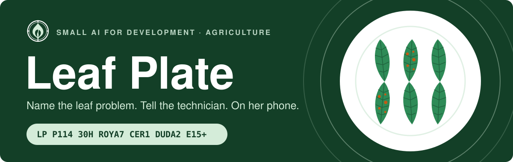
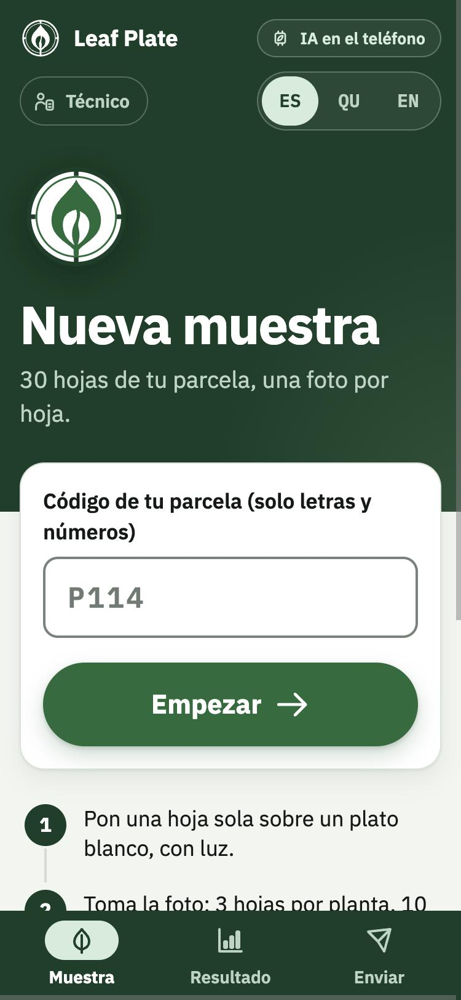
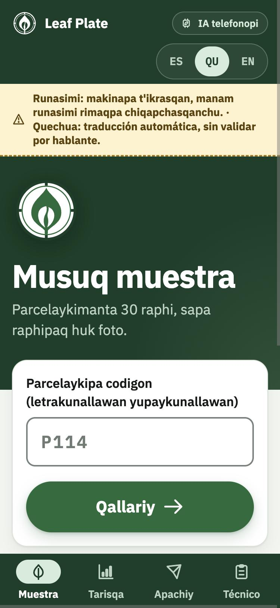
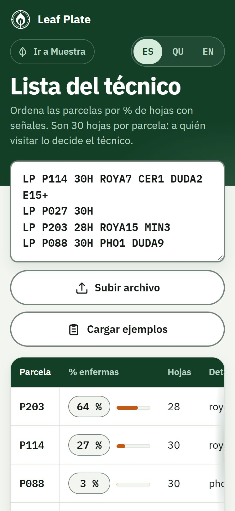
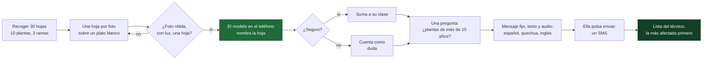

<p align="center">
  
</p>

<p align="center">
  
  
  
  
  
  
</p>

<h3 align="center">Una caficultora averigua qué tienen sus hojas y avisa al técnico el mismo fin de semana.<br>La IA corre en el teléfono; el aviso es un SMS.</h3>

<p align="center">
  <a href="https://leaf-plate-kappa.vercel.app"><b>App en línea</b></a> ·
  <a href="docs/pitch.html">Presentación</a> ·
  <a href="PLAN.md">Plan de construcción</a> ·
  <a href="DATOS.md">Ficha de datos</a> ·
  <a href="UI-UX-Modules/README.md">Diseño</a> ·
  <a href="README.md">English version</a>
</p>

<p align="center">
  Equipo Glyph Squad · World Bank × Hack-Nation <b>Small AI for Development</b> · Reto 04 · Agricultura
</p>

---

Noor fotografía 30 hojas de café sobre un plato, la app nombra el problema de cada hoja
(o dice "no estoy seguro") y prepara un SMS con el código de parcela y los conteos para el
técnico de la cooperativa. Lo único que sale del teléfono es el SMS que ella pulsa enviar.

La única IA es el clasificador de visión (5 clases + abstención). El conteo, los mensajes,
el código SMS, el filtro de calidad de la foto y la lista del técnico son reglas.

<p align="center">
  
  &nbsp;&nbsp;
  
  &nbsp;&nbsp;
  
</p>
<p align="center"><sub>La app desplegada el 4 de octubre de 2026: la pantalla de muestra en español y en quechua en borrador, y la lista del técnico con los códigos de ejemplo que trae la app.</sub></p>

> [!WARNING]
> **El modelo no está listo para la decisión de Noor.** Acierta en el 88,1 % de las hojas
> brasileñas de prueba y en el 46,7 % de hojas peruanas que nunca había visto, y casi nunca se
> abstiene ante una enfermedad con la que no fue entrenado. Las cifras están en
> [Resultados](#resultados).

## Contenido

[El problema](#el-problema) · [Cómo funciona](#cómo-funciona) · [Qué hace la IA](#qué-hace-la-ia-y-qué-no) · [Resultados](#resultados) · [Estado](#estado) · [Cómo correrlo](#cómo-correrlo) · [Datos y modelos](#datos-y-modelos) · [Idioma local](#idioma-local) · [Prototipo y solución completa](#prototipo-y-solución-completa) · [Lo que ya existe](#lo-que-ya-existe) · [Límites](#límites) · [Fuentes](#fuentes)

## El problema

Noor cultiva dos hectáreas de café en Perú; es una de unas 223.000 familias cafetaleras, el
85 % con menos de cinco hectáreas [[5]](#fuentes). Su rendimiento ha bajado y no sabe por qué.
Ve manchas en las hojas pero no puede asegurar qué problema son, y el extensionista vino dos
veces el año pasado.

| | |
|---:|---|
| **3,1 %** | de los productores peruanos recibió asistencia técnica en 2024, frente al 9,2 % en 2014 [[1]](#fuentes) |
| **44 %** | de incidencia de roya en las 12 regiones cafetaleras de Perú en 2023 (SENASA) [[2]](#fuentes) |
| **75 %** | de los cafetales de Perú tiene más de 15 años (Junta Nacional del Café, 2026) [[3]](#fuentes) |
| **631 kg/ha** | rendimiento medio del café en Perú en 2024, frente a una meta de al menos 1.200 kg/ha [[4]](#fuentes) |
| **91 días** | espera media hasta la siguiente de dos visitas al año (cálculo propio) |

En su casa hay dos teléfonos: su teléfono básico, que se queda en casa, y el smartphone de su
hija, que solo está los fines de semana. No hay Wi-Fi. Cualquier herramienta tiene que caber
en esa semana.

> **Gracias a esta herramienta,** Noor enviará al técnico de su cooperativa un conteo de qué
> problema aparece en cuántas de 30 hojas de café, el mismo fin de semana en que nota las
> manchas, un aviso que de otro modo solo daría cuando él la visita, que fue dos veces el año
> pasado; **lo sabemos porque** solo el 3,1 % de los productores peruanos recibió asistencia
> técnica en 2024 (ENA). **Lo que todavía no sabemos:** nuestro modelo acertó en el 88,1 % de
> las hojas brasileñas de prueba y solo en el 46,7 % de hojas de San Martín, Perú.

## Cómo funciona



El muestreo sigue, simplificado, el patrón de plantas y ramas con que se evalúa la roya en
Perú [[16]](#fuentes). Todo el aviso cabe en un SMS: código de parcela y conteos, sin nombre y
sin foto.

```
LP P114 30H ROYA7 CER1 DUDA2 E15+
```

Parcela P114, 30 hojas, 7 con roya, 1 con cercospora, 2 en las que el modelo dudó, plantas de
más de 15 años. Las clases con conteo cero se omiten. Como todo SMS, muestra el número de
quien lo envía, y la cooperativa puede vincular el código de parcela con su socia.

Las cuatro pantallas son **Muestra**, **Resultado** y **Enviar**, que son las pestañas de la
caficultora, y **Técnico**, una vista aparte de la misma app en `#/tecnico` (la lista del
técnico, que ordena los códigos pegados por porcentaje de hojas con señales y avisa de plantas
viejas y de muestras con muchas dudas). Un enlace bajo la barra superior pasa de una a otra.

## Qué hace la IA y qué no

| Lo único que hace la IA | A propósito, sin IA |
|---|---|
| Un modelo de visión pequeño (MobileNetV3-small, 5,8 MB) distingue cinco estados de la hoja: sana, roya, minador, cercospora, phoma. Por debajo de una confianza calibrada dice "no estoy seguro". | El filtro de calidad de la foto (nitidez, brillo, área de hoja) · el conteo · la pregunta de edad · los mensajes fijos y su audio · el código SMS · la lista y la decisión del técnico |

Un SMS no puede mirar una hoja. Lo que un SMS sí puede hacer, se lo dejamos al SMS.

**Salvaguardas**

- La decisión final es de una persona: ella pulsa enviar y el técnico decide el control.
- Una lista fija de ocho mensajes. En el teléfono no se genera texto. La pantalla de envío
  dice siempre: "Esto no es un diagnóstico. Envía el mensaje al técnico de la cooperativa; él
  decide."
- Confianza baja se cuenta como "duda"; una foto mala se rechaza y se repite. Con muchas
  dudas, el mensaje dice que el técnico debería ver las hojas.
- Sin dosis, tratamientos, rendimiento ni precio.
- Las fotos y el conteo se quedan en el teléfono. El SMS lleva solo código de parcela y conteos.
- El quechua está rotulado en pantalla como traducción automática sin validar por hablante.

La frase para el técnico redactada por un modelo de lenguaje está preparada pero apagada
(`SMS_SERVICE_ENABLED` en `app/src/adapters/smsService.ts`): el SMS lleva solo el código, que
siempre arma la app.

## Resultados

Medidos con `python ml/evaluate.py` sobre `leaf-fp32.onnx`, el archivo que lleva la app.

| Medida | Dónde | Resultado |
|---|---|---:|
| Precisión 5 clases | BRACOL test, 202 hojas (Brasil) | **88,1 %** |
| Precisión país no visto (E1) | Saposoa sana/roya, 999 fotos (Perú) | **46,7 %** |
| Lo mismo, en las fotos que sí responde | Responde el 67,1 % | 60,7 % |
| Abstención ante clase desconocida | Saposoa ojo de gallo, 500 fotos | 7,4 % |
| Cobertura con 90 % de precisión | Validación calibrada, 201 hojas [[7]](#fuentes) [[8]](#fuentes) | 89,5 % |
| Tamaño del modelo | ONNX sin cuantizar | 5,8 MB |
| Tamaño de la app, con modelo y audio | `npm run size`, meta 20 MB | 20,1 MB |

El modelo acierta en Brasil y falla en Perú, y casi nunca se abstiene ante ojo de gallo, una
enfermedad con la que no fue entrenado: tal como está no sirve para la decisión de Noor. El
umbral de abstención se ajustó con hojas brasileñas y no se sostiene en Perú.

Como referencia, una prueba de campo publicada de una herramienta parecida midió 65 % de
acierto con una hoja y de 74 a 88 % con seis [[9]](#fuentes).

Dos cosas condicionan estas cifras. El modelo se entrenó en CPU con 1.401 de las 1.747 hojas
de BRACOL, porque el zip publicado en Mendeley está cortado. Y la cuantización int8 lo hunde
(13–27 % en validación), así que la app lleva el modelo sin cuantizar; 13,7 MB de los 20,1 MB
de la app son el WASM de onnxruntime-web.

## Estado

- [x] Lógica de dominio con 38 pruebas unitarias: conteo, mensajes, SMS ida y vuelta, lista, calidad de foto, traducciones
- [x] Cuatro pantallas, en español, quechua (borrador) e inglés
- [x] El modelo real y los 78 clips de audio, comprobados en Chrome sobre el despliegue
- [x] Funciones de servidor en Vercel para enviar el SMS (Twilio o un Android como pasarela)
- [ ] Modo sin conexión comprobado en el Android (en la laptop de desarrollo Chrome no logra guardar el WASM de 14 MB)
- [ ] Un SMS realmente enviado y recibido (el servidor desplegado no tiene credenciales de SMS y responde `simulated`)
- [ ] Texto y pronunciación del quechua revisados por alguien que lo hable
- [ ] Conjunto dorado con fotos propias sobre el plato ([tests/golden](tests/golden/README.md))
- [ ] Hojas peruanas en el entrenamiento y un umbral de abstención ajustado con ellas

## Cómo correrlo

### App (`app/`)

```
npm install
npm run dev       # desarrollo; --host para abrirla desde el teléfono en la misma red
npm test          # pruebas unitarias: conteo, mensajes, SMS ida y vuelta, lista, calidad de foto
npm run build     # dist/ con service worker (modo sin conexión)
npm run size      # MB de dist/ contra la meta de 20 MB
```

Sin `app/public/models/calibration.json` y su modelo `.onnx` la app usa un **clasificador de
mentira** y lo avisa con una franja de aviso ("MODO DEMOSTRACIÓN"). Sirve para ensayar el
recorrido, no para medir nada.

El service worker y la instalación exigen HTTPS (o `localhost`). La foto se toma con el
selector de archivos de la cámara nativa, que funciona también sin HTTPS.

La interfaz empieza en español; el botón ES / QU / EN bajo la barra superior la cambia a
quechua o inglés. El texto en quechua es una traducción automática que ningún hablante ha
validado, y la app lo dice en pantalla. El aspecto y los componentes (visor de análisis, mapa
de la muestra, medidor de confianza, piezas del código SMS) siguen el diseño de
[UI-UX-Modules](UI-UX-Modules/README.md).

### Modelo (`ml/`)

```
pip install -r ml/requirements.txt
python ml/make_manifest.py --bracol ml/data/bracol/leaf --saposoa ml/data/saposoa \
    --saposoa-map "carpeta_sana=sana,carpeta_roya=roya,carpeta_ojo_de_gallo=desconocida"
python ml/train.py          # MobileNetV3-small, 2 fases -> ml/out/model.pt
python ml/export_onnx.py    # ONNX opset 17 + int8 -> app/public/models/leaf-int8.onnx
python ml/calibrate.py      # temperatura + umbral -> app/public/models/calibration.json
python ml/evaluate.py       # tabla de medidas del modelo que lleva la app -> ml/out/results.md
python ml/tts_quechua.py    # 78 clips Opus (necesita ffmpeg) -> app/public/audio/
```

Los datasets se descargan a `ml/data/` (no se suben al repo). Ver [DATOS.md](DATOS.md).

### Servidor (`api/`, Vercel)

Producción: https://leaf-plate-kappa.vercel.app (se despliega con `npx vercel deploy --prod`).

- `POST /api/send` envía el SMS al técnico. El número lo fija el servidor (`TECH_NUMBER`, con
  formato `+50370000000`) y solo acepta un código `LP` válido. Quién lo envía depende de las
  variables de entorno:
  - Twilio: `TWILIO_ACCOUNT_SID`, `TWILIO_FROM` (número `+1...` o Messaging Service `MG...`) y,
    para autenticarse, `TWILIO_AUTH_TOKEN` o bien `TWILIO_API_KEY` + `TWILIO_API_SECRET`.
  - `SMS_GATEWAY_USER` y `SMS_GATEWAY_PASSWORD`: un Android con la app
    [SMS Gateway for Android](https://github.com/capcom6/android-sms-gateway) en modo Cloud
    Server; el SMS sale por su SIM.
  - Ninguna: responde `simulated` y no envía nada.
- `POST /api/sms` devuelve la frase para el técnico: plantilla fija, o un LLM si `OLLAMA_URL`
  apunta a un servidor Ollama alcanzable.

Los secretos van en `.env`, en la raíz del proyecto, que no se sube a git. `npm run dev` y
`npm run preview` atienden `/api/*` con ese archivo. `npm run secrets:check` pregunta a Twilio
si acepta las credenciales, sin enviar nada; `npm run secrets:push` copia los valores al
proyecto de Vercel sin mostrarlos, y después hay que volver a desplegar.
`GET /api/send` dice si hay un proveedor configurado.

Enviar por el servidor necesita internet en el teléfono. El botón "Abrir SMS" usa la SIM del
propio teléfono y es el único camino que funciona sin datos.

### Estructura del repositorio

```
├─ app/            app web sin conexión (Vite + TypeScript): reglas, adaptadores, cuatro pantallas
│  └─ public/      modelo, calibración, mensajes fijos, clips de audio, service worker
├─ api/            funciones de Vercel: enviar el SMS, frase opcional para el técnico
├─ ml/             manifiesto, entrenamiento, calibración, exportación ONNX, evaluación, audio
├─ tests/          pruebas unitarias y conjunto dorado de fotos propias
├─ UI-UX-Modules/  dirección de diseño, componentes, marca, iconos y prototipo
├─ docs/           imágenes de este README y la presentación
├─ PLAN.md         plan de construcción
└─ DATOS.md        ficha de datos
```

## Datos y modelos

| Fuente | Uso | Licencia | Tamaño | Lo que no cubre |
|---|---|---|---|---|
| [BRACOL](https://data.mendeley.com/datasets/yy2k5y8mxg/1), Brasil | Entrenar, validar y probar (70/15/15 por hoja) | CC BY 4.0 | 1.747 hojas; pudimos leer 1.401 | Hojas peruanas; fotos de patio sobre un plato; ojo de gallo; deficiencias de nutrientes |
| [Conjunto de Saposoa](https://data.mendeley.com/datasets/mfpxg4y65r/2), UNMSM, Perú | Solo evaluar: país no visto y abstención ante ojo de gallo | CC BY 4.0 | 1.500 imágenes | Minador, cercospora, phoma; es San Martín, no Cusco |
| [MobileNetV3-small](https://huggingface.co/timm/mobilenetv3_small_100.lamb_in1k), timm | Red base, exportada a ONNX | Apache 2.0 | 5,8 MB tal como va en la app | Pruebas en café anteriores a la nuestra |
| [MMS-TTS quechua cusqueño](https://huggingface.co/facebook/mms-tts-quz) y español, Meta | Convertir en audio, por adelantado, los mensajes fijos y los números del 0 al 30 | CC BY-NC 4.0 (solo demo) | 78 clips, 0,65 MB en la app | Uso comercial; validación por un hablante nativo |

Ninguno de los dos conjuntos tiene fotos hechas por caficultoras con un Android de gama baja.
Eso solo lo cubriría nuestro conjunto dorado, que aún no existe. BRACOL se fotografió por el
envés sobre fondo blanco; el plato blanco copia esas condiciones en vez de pelear con ellas.
Los detalles y lo que falta verificar están en [DATOS.md](DATOS.md).

## Idioma local

La interfaz y el audio cambian entre español, **quechua Cusco–Collao** e inglés.

Nadie del equipo habla quechua. El texto en quechua es traducción automática y la voz es
sintética, y cada pantalla en quechua lo dice. Falta la retraducción con un segundo motor y
falta la revisión de una persona hablante. Antes de que una caficultora lo escuche, una socia
de la cooperativa tiene que validar y volver a grabar las frases. Añadir un idioma exige que
un hablante traduzca y grabe 39 clips cortos, no un modelo nuevo: el teléfono solo reproduce
grabaciones.

## Prototipo y solución completa

| | Prototipo (este repositorio) | Solución completa |
|---|---|---|
| Foto | Una hoja por foto sobre un plato blanco | Varias hojas por foto, separadas sobre el fondo blanco |
| Clases | Cinco, más "no estoy seguro" | Añade ojo de gallo y deficiencias de nutrientes |
| Modelo | Entrenado solo con hojas brasileñas | Reentrenado con fotos peruanas tomadas con consentimiento |
| Idioma | Quechua traducido por máquina con voz sintética, rotulado como borrador | Frases validadas y grabadas por socias de la cooperativa |
| Lista del técnico | Una página que ordena los códigos SMS pegados | Un Android en la cooperativa que lee los SMS y los une a su padrón de parcelas |
| Evidencia | Precisión en hojas apartadas y en hojas peruanas, tamaño del modelo y de la app | Un piloto de campo con una cooperativa que mida visitas, tiempos y cosecha |

## Lo que ya existe

Cada pieza existe en algún lugar; el clasificador no es invento nuestro. Coffee Cloud, de
Anacafé, registra a mano muestreos de roya [[10]](#fuentes). El piloto Tarpuy [[11]](#fuentes)
y una app de escaneo para cooperativas [[12]](#fuentes) diagnostican hojas de café con IA en
Perú. Plantix tiene la roya del café en su biblioteca. PlantVillage Nuru funciona sin
conexión, pero no para café [[13]](#fuentes). CottonAce, de Wadhwani AI, cuenta plagas en una
foto y da consejos fijos [[14]](#fuentes). DIGITAGRO, del Banco Mundial, envió videos de
extensión en mam por WhatsApp [[15]](#fuentes).

Nuestra búsqueda del 3 de octubre de 2026 no encontró una herramienta que combine café, IA en
el teléfono, una muestra contada, voz en lengua indígena y un SMS al técnico. Eso es ausencia
de evidencia, no una prueba.

## Límites

- El modelo falla con hojas peruanas (46,7 %) y rara vez se abstiene ante una enfermedad que
  no conoce (7,4 %). Mientras eso no cambie, sus conteos confundirían al técnico.
- Ningún estudio publicado mide la cosecha que se salva con un diagnóstico temprano de la
  hoja. Ese número tiene que salir de un piloto con una cooperativa; lo propondríamos a las
  cooperativas de La Convención [[6]](#fuentes).
- Nombrar la roya no la cura. Sin un técnico y un padrón de socios en la cooperativa, esta
  herramienta no sirve.
- Los datos de entrenamiento no tienen hojas de Cusco, y el conjunto peruano de prueba solo
  cubre sana y roya. La app no puede nombrar el ojo de gallo.
- El SMS sale del teléfono de la hija. El consentimiento de la familia y quién paga el
  mensaje son preguntas para el piloto.
- La cobertura celular en Santa Teresa y que la cooperativa tenga técnico y padrón utilizables
  son supuestos sin verificar. Las cifras de contexto vienen de notas de prensa sobre datos
  oficiales, no de las fuentes oficiales mismas.

## Fuentes

1. Encuesta Nacional Agropecuaria 2024, vía [Agraria.pe](https://agraria.pe/noticias/el-34-4-de-los-productores-agropecuarios-en-peru-se-concentr-39858)
2. SENASA, 2023, vía [Agraria.pe](https://agraria.pe/noticias/senasa-reporta-que-roya-amarilla-afecta-al-44-del-area-cafet-33912)
3. Junta Nacional del Café, julio de 2026, vía [Agraria.pe](https://agraria.pe/noticias/produccion-nacional-de-cafe-caeria-hasta-20-este-ano-por-fal-42740)
4. Junta Nacional del Café, agosto de 2025, vía [Agraria.pe](https://agraria.pe/noticias/jnc-entre-el-70-y-75-del-area-de-cafe-en-peru-requieren-reno-40483)
5. Cifras del sector café, MIDAGRI, 2026, vía [Agraria.pe](https://agraria.pe/noticias/el-sector-cafe-se-consolida-como-una-importante-fuente-de-42963)
6. Cooperativas cafetaleras de La Convención (COCLA: 21 cooperativas, más de 3.500 familias), [InterAmerican Coffee](https://interamericancoffee.com/?p=12022)
7. Escalado de temperatura: [Guo et al., 2017](https://arxiv.org/abs/1706.04599)
8. Clasificación selectiva: [Geifman y El-Yaniv, 2017](https://arxiv.org/abs/1705.08500)
9. Evaluación de campo de Nuru, [Frontiers in Plant Science, 2020](https://www.frontiersin.org/journals/plant-science/articles/10.3389/fpls.2020.590889/pdf)
10. Coffee Cloud, [Perfect Daily Grind, 2018](https://perfectdailygrind.com/2018/09/combating-leaf-rust-with-phone-apps-in-guatemala/)
11. Tarpuy, [RIVAR, 2025](https://revistarivar.usach.cl/wp-content/uploads/2025/08/art13_206_224.pdf)
12. App de escaneo para cooperativas, [ADA–SSNUP, 2022](https://adaimpact.lu/en/ssnup-project-completion-mobile-application-provides-peruvian-coffee-growers-information-good)
13. PlantVillage Nuru, [PlantwisePlus, 2020](https://blog.plantwise.org/2020/03/13/nuru-ai-expansion-supporting-farmers-to-diagnose-crop-diseases)
14. CottonAce, [Wadhwani AI](https://aiopportunity.wadhwaniai.org/main-page-dev-lib/cottonace)
15. Evaluación de impacto de DIGITAGRO, [Banco Mundial, 2022](https://documents1.worldbank.org/curated/en/099658107212218638/pdf/IDU0ed8f13cd06373042d00973b06788b30b98a8.pdf)
16. Muestreo de roya por plantas y ramas, [Perú](https://portal.amelica.org/ameli/journal/605/6053162010/html/)

## Licencia

MIT. Ver [LICENSE](LICENSE). Los datasets y los modelos de voz conservan sus propias licencias,
indicadas en [Datos y modelos](#datos-y-modelos).

---

<p align="center"><sub>Equipo Glyph Squad · Construido el 3 y 4 de octubre de 2026 · El personaje "Noor" viene de la nota conceptual del hackathon.</sub></p>
