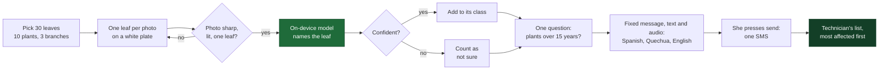

<p align="center">
  
</p>

<p align="center">
  
  
  
  
  
  
</p>

<h3 align="center">A coffee farmer finds out what is on her leaves and tells the technician the same weekend.<br>The naming runs on the phone; the report is one SMS.</h3>

<p align="center">
  <a href="https://leaf-plate-kappa.vercel.app"><b>Live app</b></a> ·
  <a href="docs/pitch.html">Pitch deck</a> ·
  <a href="PLAN.md">Build plan</a> ·
  <a href="DATOS.md">Data sheet</a> ·
  <a href="UI-UX-Modules/README.md">Design</a> ·
  <a href="README.es.md">Versión en español</a>
</p>

<p align="center">
  Team Glyph Squad · World Bank × Hack-Nation <b>Small AI for Development</b> · Challenge 04 · Agriculture
</p>

---

Noor photographs 30 coffee leaves on a plate. The app names the problem on each leaf (or says
"not sure") and prepares an SMS with the plot code and the counts for the cooperative's field
technician. The only thing that leaves the phone is the SMS she chooses to send.

The only AI is the vision classifier (5 classes plus abstention). The counting, the messages,
the SMS code, the photo quality filter and the technician's list are all rules.

<p align="center">
  
  &nbsp;&nbsp;
  
  &nbsp;&nbsp;
  
</p>
<p align="center"><sub>The deployed app on 4 October 2026: the sample screen in Spanish and in draft Quechua, and the technician's list with the built-in example codes.</sub></p>

> [!WARNING]
> **The model is not ready for Noor's decision.** It is right on 88.1% of Brazilian test leaves
> and on 46.7% of Peruvian leaves it had never seen, and it almost never abstains on a disease
> it was not trained on. The numbers are in [Results](#results).

## Contents

[The problem](#the-problem) · [How it works](#how-it-works) · [What the AI does](#what-the-ai-does-and-what-it-does-not) · [Results](#results) · [Status](#status) · [Run it](#run-it) · [Data and models](#data-and-models) · [Local language](#local-language) · [Prototype and full solution](#prototype-and-full-solution) · [What already exists](#what-already-exists) · [Limits](#limits) · [Sources](#sources)

## The problem

Noor farms two hectares of coffee in Peru, one of about 223,000 coffee families, 85% of them
on under five hectares [[5]](#sources). Her yield has slipped and she cannot say why. She sees
spots on the leaves but cannot be sure which problem they are, and the extension officer came
twice last year.

| | |
|---:|---|
| **3.1%** | of Peruvian producers received technical assistance in 2024, down from 9.2% in 2014 [[1]](#sources) |
| **44%** | rust incidence across Peru's 12 coffee regions in 2023 (SENASA) [[2]](#sources) |
| **75%** | of Peru's coffee plantations are over 15 years old (Junta Nacional del Café, 2026) [[3]](#sources) |
| **631 kg/ha** | Peru's average coffee yield in 2024, against a target of at least 1,200 kg/ha [[4]](#sources) |
| **91 days** | average wait for the next of two visits a year (our arithmetic) |

Her household has two phones: her basic phone, which stays at the house, and her daughter's
smartphone, which is only home at weekends. There is no Wi-Fi. Any tool has to fit that week.

> **Because of this tool,** Noor will send her cooperative's technician a count of which leaf
> problem shows on how many of 30 coffee leaves, the same weekend she notices spots, a report
> she would otherwise make only when he visits, which was twice last year; **we know because**
> only 3.1% of Peruvian producers received technical assistance in 2024 (ENA). **What we do not
> know yet:** our model was right on 88.1% of Brazilian test leaves and on only 46.7% of leaves
> from San Martín, Peru.

## How it works



Sampling follows the plant-and-branch pattern used to evaluate rust in Peru, simplified
[[16]](#sources). The whole report fits in one SMS: a plot code and counts, no name and no photo.

```
LP P114 30H ROYA7 CER1 DUDA2 E15+
```

Plot P114, 30 leaves, 7 with rust, 1 with cercospora, 2 the model was not sure about, plants
over 15 years old. Classes with a count of zero are left out. Like any SMS it shows the
sender's number, and the cooperative can link the plot code to its member.

The four screens are **Muestra** (sample), **Resultado** (result) and **Enviar** (send), which
are the farmer's tabs, and **Técnico**, a separate view of the same app at `#/tecnico` (the
technician's list, which sorts pasted codes by the share of leaves with signs and flags old
plants and samples with many doubts). A link under the top bar switches between the two.

## What the AI does, and what it does not

| The one thing AI does | Deliberately not AI |
|---|---|
| A small vision model (MobileNetV3-small, 5.8 MB) tells five leaf conditions apart: healthy, rust, leaf miner, cercospora, phoma. Below a calibrated confidence it says "not sure". | The photo quality filter (sharpness, brightness, leaf area) · counting the leaves · the plant-age question · the fixed messages and their audio · the SMS code · the technician's list and decision |

An SMS cannot look at a leaf. What an SMS can do, we leave to SMS.

**Guardrails**

- A person makes the final call: she presses send, and the technician decides the control.
- A fixed list of eight messages. Nothing is generated on the phone. The send screen always
  says: "This is not a diagnosis. Send the message to the cooperative's technician, who decides."
- Low confidence becomes "not sure"; a bad photo is rejected and retaken. With many doubts, the
  message says the technician should look at the leaves.
- No doses, treatments, yield or price.
- Photos and counts stay on the phone. The SMS carries a plot code and counts only.
- The Quechua is labelled on screen as a machine translation that no speaker has validated.

Under the code, the SMS can carry one sentence for the technician (`SMS_SERVICE_ENABLED` in
`app/src/adapters/smsService.ts`, switched on). The code itself is always built by the app.
With the laptop's address set on the Enviar screen ("Laptop que redacta la frase"), the
sentence comes from the laptop gateway described below (`gateway/`, `POST /api/sms`): the
model runs on the laptop, never on the phone, and the server validates every sentence against
the counts and falls back to a fixed template. With no address, the server that serves the
app answers with its own fixed template (`api/sms.js`). The screen says whether the sentence
was written by the model or comes from a template, and the phone sends the code alone
whenever nobody answers within 10 seconds.

## Results

Measured with `python ml/evaluate.py` on `leaf-fp32.onnx`, the file the app ships.

| Measure | Where | Result |
|---|---|---:|
| 5-class accuracy | BRACOL test, 202 leaves (Brazil) | **88.1%** |
| Accuracy on an unseen country (E1) | Saposoa healthy/rust, 999 photos (Peru) | **46.7%** |
| The same, on the photos it does answer | It answers 67.1% of them | 60.7% |
| Abstention on an unknown class | Saposoa "ojo de gallo", 500 photos | 7.4% |
| Coverage at 90% accuracy | Calibrated validation, 201 leaves [[7]](#sources) [[8]](#sources) | 89.5% |
| Model size | Unquantized ONNX | 5.8 MB |
| App size, with model and audio | `npm run size`, goal 20 MB | 20.1 MB |

The model is right in Brazil and wrong in Peru, and it almost never abstains on "ojo de
gallo", a disease it was not trained on: as it stands it is not fit for Noor's decision. The
refusal threshold was tuned on Brazilian leaves and does not hold in Peru.

For scale, a published field test of a similar tool found 65% accuracy with one leaf and 74 to
88% with six [[9]](#sources).

Two things shaped these numbers. The model was trained on CPU with 1,401 of BRACOL's 1,747
leaves, because the zip published on Mendeley is truncated. And int8 quantization wrecks it
(13–27% on validation), so the app ships the unquantized model; 13.7 MB of the app's 20.1 MB is
the onnxruntime-web WASM.

## Status

- [x] Domain logic with 38 unit tests: counting, messages, SMS round trip, ranking, photo quality, translations
- [x] Four screens, in Spanish, Quechua (draft) and English
- [x] The real model and the 78 audio clips, checked in Chrome against the deployment
- [x] Server functions on Vercel for sending the SMS (Twilio or an Android phone gateway)
- [x] Laptop gateway (FastAPI + Ollama 0.35.1, offline): `/ws` for the team's tools and `POST /api/sms` with validation and fallback, 244 tests, checked over the LAN
- [ ] Offline mode verified on the Android phone (on the development laptop Chrome fails to cache the 14 MB WASM)
- [ ] An SMS actually sent and received (the deployed server has no SMS credentials and answers `simulated`)
- [ ] Quechua wording and pronunciation reviewed by a speaker
- [ ] A golden set of our own plate photos ([tests/golden](tests/golden/README.md))
- [ ] Peruvian leaves in training, and a refusal threshold tuned on them

## Run it

### App (`app/`)

```
npm install
npm run dev       # development; --host lets you open it from a phone on the same network
npm test          # unit tests: counting, messages, SMS round trip, ranking, photo quality
npm run build     # dist/ with service worker (offline mode)
npm run size      # MB of dist/ against the 20 MB goal
```

Without `app/public/models/calibration.json` and its `.onnx` model the app uses a **fake
classifier** and says so with an amber warning strip ("MODO DEMOSTRACIÓN"). It is good for
rehearsing the flow, not for measuring anything.

The service worker and installation require HTTPS (or `localhost`). Photos are taken through
the native camera file picker, which also works without HTTPS.

The interface starts in Spanish; the ES / QU / EN button under the top bar switches it to
Quechua or English. The Quechua text is a machine translation that no speaker has validated,
and the app says so on screen. The look and the components (analysis viewer, sample map,
confidence meter, SMS code parts) follow the design in [UI-UX-Modules](UI-UX-Modules/README.md).

### Model (`ml/`)

```
pip install -r ml/requirements.txt
python ml/make_manifest.py --bracol ml/data/bracol/leaf --saposoa ml/data/saposoa \
    --saposoa-map "carpeta_sana=sana,carpeta_roya=roya,carpeta_ojo_de_gallo=desconocida"
python ml/train.py          # MobileNetV3-small, 2 phases -> ml/out/model.pt
python ml/export_onnx.py    # ONNX opset 17 + int8 -> app/public/models/leaf-int8.onnx
python ml/calibrate.py      # temperature + threshold -> app/public/models/calibration.json
python ml/evaluate.py       # results table for the model the app ships -> ml/out/results.md
python ml/tts_quechua.py    # 78 Opus clips (needs ffmpeg) -> app/public/audio/
```

Datasets are downloaded to `ml/data/` (not committed to the repo). See [DATOS.md](DATOS.md)
(in Spanish).

### Server (`api/`, Vercel)

Production: https://leaf-plate-kappa.vercel.app (deployed with `npx vercel deploy --prod`).

- `POST /api/send` sends the SMS to the technician. The number is fixed by the server
  (`TECH_NUMBER`, formatted like `+50370000000`) and it only accepts a valid `LP` code. Who
  sends it depends on the environment variables:
  - Twilio: `TWILIO_ACCOUNT_SID`, `TWILIO_FROM` (a `+1...` number or an `MG...` Messaging
    Service) and, to authenticate, either `TWILIO_AUTH_TOKEN` or `TWILIO_API_KEY` +
    `TWILIO_API_SECRET`.
  - `SMS_GATEWAY_USER` and `SMS_GATEWAY_PASSWORD`: an Android phone running
    [SMS Gateway for Android](https://github.com/capcom6/android-sms-gateway) in Cloud Server
    mode; the SMS goes out through its SIM.
  - None: it answers `simulated` and sends nothing.
- `POST /api/sms` returns the sentence for the technician: a fixed template, or an LLM if
  `OLLAMA_URL` points to a reachable Ollama server. This is the online stand-in; the version
  the plan describes runs on the demo laptop (next section).

Secrets go in `.env`, at the project root, which is not committed to git. `npm run dev` and
`npm run preview` serve `/api/*` using that file. `npm run secrets:check` asks Twilio whether
it accepts the credentials, without sending anything; `npm run secrets:push` copies the values
to the Vercel project without printing them, after which you need to redeploy.
`GET /api/send` reports whether a provider is configured.

Sending through the server needs internet on the phone. The "Abrir SMS" button uses the
phone's own SIM and is the only path that works without mobile data.

### Laptop gateway (`gateway/`, FastAPI + Ollama, offline)

The demo laptop runs a small FastAPI server in front of a local Ollama (v0.35.1, cloud
features disabled) that reaches the phone over the hotspot by IP, with no internet. It is
tooling for the team, never a dependency of the app: a unit test fails if `app/src` ever
imports it or opens a WebSocket to it.

- `POST /api/sms` on the laptop is the LLM sentence service from [PLAN.md](PLAN.md)
  (`llama3.2:3b`, temperature 0, JSON output, 10 s limit, server-side validation, fixed
  template fallback). It answers the same request and response the app's
  `requestSentence` already sends.
- `/ws` exposes every Ollama action (chat, generate, embed, System One, model management)
  to the team's laptop tools: Quechua translation drafts, back-translation checks with a
  decision model, embedding similarity, demo warm-up, an ops panel.

```
cd gateway
uv sync --frozen                       # pinned dependencies, install while online
cp .env.example .env                   # set GATEWAY_TOKEN and the laptop's LAN IP
set -a; source .env; set +a; python -m gateway
```

To use it from the app: run the gateway with `GATEWAY_PORT=8000` and the app's address in
`GATEWAY_ALLOWED_ORIGINS` (the Enviar screen shows the exact value), then type the laptop's
address under "Laptop que redacta la frase". Only the sentence comes from the laptop; the
SMS is still sent by the server that serves the app, or by the phone's own SIM. From the
https deployment, Chrome lets the page call the laptop only after the site is granted its
local-network permission (checked with desktop Chrome 154: the call fails without the
permission and works with it; not yet tried on the Android phone).

Setup of the Ollama server, the protocol, every action with an example, the SMS validation
rules, the tests (244) and the live checks are in [gateway/README.md](gateway/README.md).

### Repository layout

```
├─ app/            offline web app (Vite + TypeScript): domain rules, adapters, four screens
│  └─ public/      model, calibration, fixed messages, audio clips, service worker
├─ api/            Vercel functions: send the SMS, optional sentence for the technician
├─ gateway/        laptop-only FastAPI + Ollama gateway: /ws for the team's tools, /api/sms offline
├─ ml/             manifest, training, calibration, ONNX export, evaluation, audio rendering
├─ tests/          unit tests and the golden set of our own photos
├─ UI-UX-Modules/  design direction, components, brand, icons and prototype
├─ docs/           images for this README and the pitch deck
├─ PLAN.md         build plan (in Spanish)
└─ DATOS.md        data sheet (in Spanish)
```

## Data and models

| Source | Used for | Licence | Size | What it does not cover |
|---|---|---|---|---|
| [BRACOL](https://data.mendeley.com/datasets/yy2k5y8mxg/1), Brazil | Training, validation and test (70/15/15 by leaf) | CC BY 4.0 | 1,747 leaves; we could read 1,401 | Peruvian leaves; photos taken in a yard on a plate; ojo de gallo; nutrient deficiencies |
| [Saposoa set](https://data.mendeley.com/datasets/mfpxg4y65r/2), UNMSM, Peru | Evaluation only: unseen country, and abstention on ojo de gallo | CC BY 4.0 | 1,500 images | Leaf miner, cercospora, phoma; it is San Martín, not Cusco |
| [MobileNetV3-small](https://huggingface.co/timm/mobilenetv3_small_100.lamb_in1k), timm | Base network, exported to ONNX | Apache 2.0 | 5.8 MB as shipped | Any test on coffee before ours |
| [MMS-TTS Cusco Quechua](https://huggingface.co/facebook/mms-tts-quz) and Spanish, Meta | Rendering the fixed messages and the numbers 0 to 30 as audio, in advance | CC BY-NC 4.0 (demo only) | 78 clips, 0.65 MB in the app | Commercial use; validation by a native speaker |

Neither image set has photos taken by farmers with a low-cost Android. Only our own golden
set would cover that, and it is not built yet. BRACOL was photographed underside up on a white
background; the white plate copies those conditions instead of fighting them. Details and open
checks are in [DATOS.md](DATOS.md).

## Local language

The interface and the audio switch between Spanish, **Cusco–Collao Quechua** and English.

Nobody on our team speaks Quechua. The Quechua text is a machine translation and the voice is
synthetic, and every Quechua screen says so. The check by translating back with a second
engine is still to do, and so is the review by a speaker. Before any farmer hears it, a
cooperative member must validate and re-record the phrases. Adding a language needs a speaker
to translate and record 39 short clips, not a new model: the phone only plays recordings.

## Prototype and full solution

| | Prototype (this repository) | Full solution |
|---|---|---|
| Photo | One leaf per photo on a white plate | Several leaves per photo, separated on the white background |
| Classes | Five, plus "not sure" | Adds ojo de gallo and nutrient deficiencies |
| Model | Trained on Brazilian leaves only | Retrained with Peruvian photos taken with consent |
| Language | Machine-translated Quechua with a synthetic voice, labelled as a draft | Phrases validated and recorded by cooperative members |
| Technician's list | A page that sorts pasted SMS codes | An Android at the cooperative that reads SMS and joins them to its plot registry |
| Evidence | Accuracy on held-out and Peruvian leaves, model and app size | A field pilot with a cooperative that measures visits, times and harvest |

## What already exists

Every piece exists somewhere; the classifier is not our invention. Anacafé's Coffee Cloud
records rust samples by hand [[10]](#sources). The Tarpuy pilot [[11]](#sources) and a
cooperative scanner app [[12]](#sources) diagnose coffee leaves with AI in Peru. Plantix lists
coffee rust in its library. PlantVillage Nuru runs offline, without coffee [[13]](#sources).
Wadhwani AI's CottonAce counts pests in a photo and gives fixed advice [[14]](#sources). The
World Bank's DIGITAGRO sent extension videos in Mam by WhatsApp [[15]](#sources).

Our search on 3 October 2026 found no tool that combines coffee, on-device AI, a counted
sample, an indigenous-language voice and an SMS to the technician. That is absence of
evidence, not proof.

## Limits

- The model fails on Peruvian leaves (46.7%) and rarely abstains on a disease it does not
  know (7.4%). Until that changes, its counts would mislead the technician.
- No published study measures the harvest saved by early leaf diagnosis. A cooperative pilot
  must produce that number; La Convención's cooperatives are where we would propose it
  [[6]](#sources).
- Naming rust does not cure it. Without a technician and a member registry at the cooperative,
  this tool does not work.
- The training data has no leaves from Cusco, and the Peruvian test set covers only healthy
  and rust. The app cannot name ojo de gallo.
- The SMS leaves from the daughter's phone. The family's consent and who pays for the message
  are questions for the pilot.
- Mobile coverage in Santa Teresa and a usable technician and registry at the cooperative are
  assumptions we have not verified. The context figures come from press reports of official
  data, not from the official sources themselves.

## Sources

1. Encuesta Nacional Agropecuaria 2024, via [Agraria.pe](https://agraria.pe/noticias/el-34-4-de-los-productores-agropecuarios-en-peru-se-concentr-39858)
2. SENASA, 2023, via [Agraria.pe](https://agraria.pe/noticias/senasa-reporta-que-roya-amarilla-afecta-al-44-del-area-cafet-33912)
3. Junta Nacional del Café, July 2026, via [Agraria.pe](https://agraria.pe/noticias/produccion-nacional-de-cafe-caeria-hasta-20-este-ano-por-fal-42740)
4. Junta Nacional del Café, August 2025, via [Agraria.pe](https://agraria.pe/noticias/jnc-entre-el-70-y-75-del-area-de-cafe-en-peru-requieren-reno-40483)
5. MIDAGRI coffee sector figures, 2026, via [Agraria.pe](https://agraria.pe/noticias/el-sector-cafe-se-consolida-como-una-importante-fuente-de-42963)
6. Coffee cooperatives in La Convención (COCLA: 21 cooperatives, more than 3,500 families), [InterAmerican Coffee](https://interamericancoffee.com/?p=12022)
7. Temperature scaling: [Guo et al., 2017](https://arxiv.org/abs/1706.04599)
8. Selective classification: [Geifman and El-Yaniv, 2017](https://arxiv.org/abs/1705.08500)
9. Nuru field evaluation, [Frontiers in Plant Science, 2020](https://www.frontiersin.org/journals/plant-science/articles/10.3389/fpls.2020.590889/pdf)
10. Coffee Cloud, [Perfect Daily Grind, 2018](https://perfectdailygrind.com/2018/09/combating-leaf-rust-with-phone-apps-in-guatemala/)
11. Tarpuy, [RIVAR, 2025](https://revistarivar.usach.cl/wp-content/uploads/2025/08/art13_206_224.pdf)
12. Cooperative scanner app, [ADA–SSNUP, 2022](https://adaimpact.lu/en/ssnup-project-completion-mobile-application-provides-peruvian-coffee-growers-information-good)
13. PlantVillage Nuru, [PlantwisePlus, 2020](https://blog.plantwise.org/2020/03/13/nuru-ai-expansion-supporting-farmers-to-diagnose-crop-diseases)
14. CottonAce, [Wadhwani AI](https://aiopportunity.wadhwaniai.org/main-page-dev-lib/cottonace)
15. DIGITAGRO impact evaluation, [World Bank, 2022](https://documents1.worldbank.org/curated/en/099658107212218638/pdf/IDU0ed8f13cd06373042d00973b06788b30b98a8.pdf)
16. Rust sampling by plants and branches, [Peru](https://portal.amelica.org/ameli/journal/605/6053162010/html/)

## License

MIT. See [LICENSE](LICENSE). The datasets and the voice models keep their own licences, listed
under [Data and models](#data-and-models).

---

<p align="center"><sub>Team Glyph Squad · Built on 3–4 October 2026 · The persona "Noor" comes from the hackathon's concept note.</sub></p>
