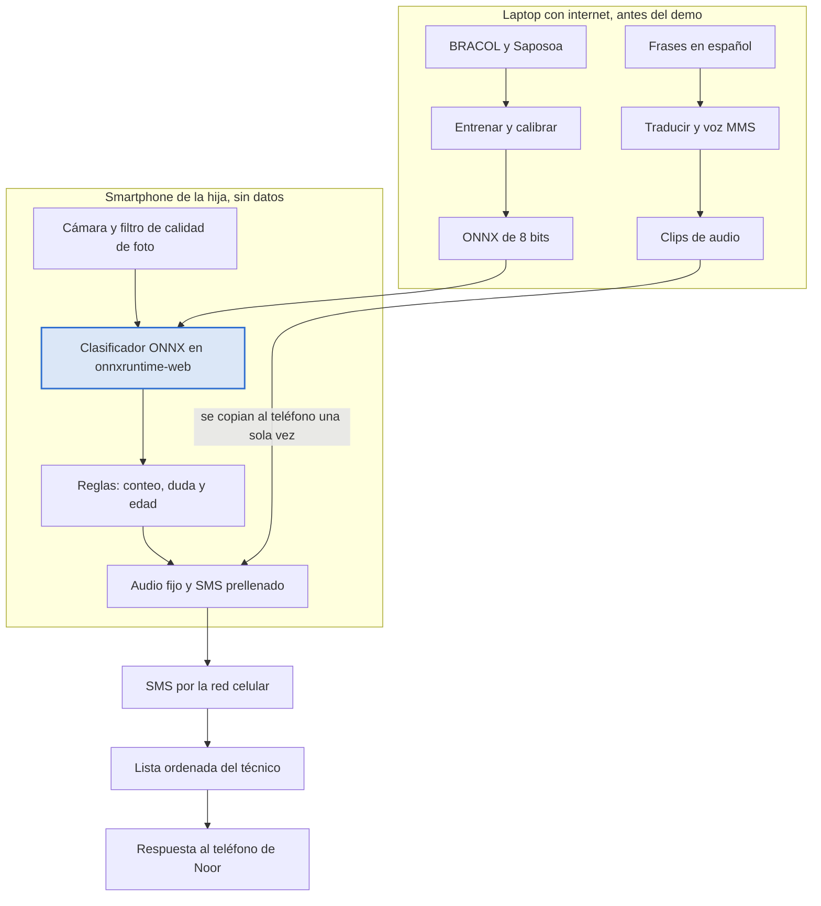
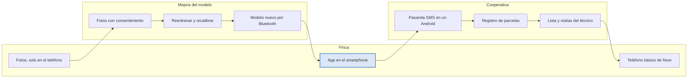

# Leaf Plate: blueprint técnico

**Fecha:** Oct 3, 2026 · **Autor:** @Arturo Boquin

---

## Índice

1. [Resumen](#resumen)
2. [Contexto](#contexto)
3. [Restricciones del brief](#restricciones-del-brief)
4. [Demo frente a solución completa](#demo-frente-a-solución-completa)
5. [Flujo de usuario](#flujo-de-usuario)
6. [Arquitectura](#arquitectura)
7. [Modelo de visión](#modelo-de-visión)
8. [App](#app)
9. [Idioma](#idioma)
10. [Evidencia](#evidencia)
11. [Plan de trabajo de 8 horas](#plan-de-trabajo-de-8-horas)
12. [Riesgos y supuestos](#riesgos-y-supuestos)
13. [Fuentes](#fuentes)

---

## Resumen

Leaf Plate apoya una sola decisión: que una caficultora nombre el problema de sus hojas y avise al técnico de su cooperativa el mismo fin de semana, sin datos móviles y con los teléfonos que su familia ya tiene.

**Qué hace.** Ella recoge 30 hojas, las fotografía sobre un plato blanco y un clasificador en el teléfono nombra cada hoja (sana, roya, minador, cercospora, phoma) o dice "no estoy seguro". La app cuenta, pregunta si las plantas tienen más de 15 años, reproduce un mensaje fijo en quechua y español y abre un SMS prellenado. El técnico recibe una lista de parcelas ordenada por porcentaje de hojas enfermas y decide.

**Dónde.** Santa Teresa, La Convención, Cusco (Perú). Lengua local: quechua Cusco-Collao.

**La única IA es visión.** Contar, preguntar la edad, los mensajes, el audio, el SMS y la lista del técnico son reglas o contenido fijo.

**Demo (8 horas).** Una hoja por foto, cinco clases, abstención calibrada, pregunta de edad, audio en quechua como borrador de máquina, SMS prellenado y la lista del técnico armada a partir de los códigos recibidos.

**Solución completa.** Varias hojas por foto, deficiencias nutricionales, quechua validado y grabado por socias, pasarela SMS en la cooperativa unida a su registro de parcelas, y un piloto de campo que mida cuánto cambia la cosecha.

**Lo que no promete.** No da dosis ni tratamientos, no predice rendimiento ni precio, y no afirma cuánta cosecha salva: eso lo tiene que medir un piloto.

---

## Contexto

El reto es el sector agricultura del hackathon *Small AI for Development* (Banco Mundial y Hack-Nation): el rendimiento del café de Noor bajó, no sabe por qué, y el extensionista llegó a su comunidad dos veces en el año.

**Noor, según el brief.** Tiene 38 años y 2 hectáreas: café en la parte alta, maíz y frijol abajo. Es socia de una cooperativa cafetalera desde hace once años. En casa habla su lengua local y usa la nacional cuando hace falta. El hogar tiene dos teléfonos: el básico de ella (llamadas, mensajes, dinero móvil), que se queda en la casa mientras trabaja, y el smartphone de su hija de 16 años, que solo está en casa los fines de semana. No hay Wi-Fi; compran paquetes 3G cuando los necesitan.

**Lo que eso impone al diseño.**

- La IA corre el fin de semana, en el smartphone, sin datos.
- Las hojas van al teléfono, no el teléfono a la ladera. El plato blanco reproduce además las condiciones del dataset de entrenamiento.
- Entre semana solo sirve lo que llega por SMS o llamada al teléfono básico.

**Dónde la ubicamos y con qué cifras.**

| Rasgo | Dato | Fuente |
|---|---|---|
| Familias cafetaleras en Perú | 223.000 en 427.000 ha; 85% con menos de 5 ha | MIDAGRI vía Agraria.pe, 2026 |
| Rendimiento | 631 kg/ha en 2024; la meta mínima es 1.200 | JNC vía Agraria.pe, 2025 |
| Plantaciones viejas | 75% con más de 15 años; la cosecha 2026 caería 15-20% | JNC vía Agraria.pe, julio 2026 |
| Asistencia técnica | 3,1% de los productores en 2024 (9,2% en 2014) | ENA 2024 vía Agraria.pe |
| Roya hoy | 44% de incidencia en 12 regiones cafetaleras (2023) | SENASA vía Agraria.pe |
| Roya en 2013 | 279.000 ha afectadas; US$330 millones perdidos en las 55.000 ha más dañadas | MINAG y JNC vía Agraria.pe |
| Lugar | La Convención: 204.000 habitantes (2025); Santa Teresa: 6.714 | INEI vía citypopulation |
| Cooperativas | COCLA: 21 cooperativas, más de 3.500 familias, fincas entre 1.400 y 2.200 m | InterAmerican Coffee |
| Productores organizados | Cerca de 20% (dato de 2020) | Gestión |
| Teléfonos | 83,6% de la población rural usa celular; 21,7% de los hogares rurales tiene internet | INEI, 2024-25 |
| Lengua | Más de 500.000 quechuahablantes en Cusco | La República, 2019 |

Las fincas de COCLA están sobre los 1.400 m, donde la sequía de 2026 golpeó menos. Ahí la caída de rendimiento se explica más por plagas y plantas viejas que por lluvia, y por eso el flujo incluye la pregunta de edad.

---

## Restricciones del brief

El diseño cumple todas las reglas; la del idioma local se cumple como borrador sin validar, y hay que decirlo.

| Regla del brief | Cómo la cumple Leaf Plate | Cómo se ve en el demo |
|---|---|---|
| Una herramienta, un sector, una decisión | Agricultura: nombrar el problema de la hoja y avisar al técnico | Un solo flujo, sin precio ni pronósticos |
| Dispositivo que ya tiene | Smartphone de la hija para la foto y el SMS; el técnico responde al teléfono básico de Noor | Android de gama baja en cámara |
| Función central sin conexión | Clasificador, reglas y audio viven en el teléfono; el SMS usa la red celular y espera en la bandeja si no hay señal | Datos y Wi-Fi apagados durante toda la demo |
| Archivos pequeños | Meta: menos de 20 MB en total; se reporta el tamaño medido | Cifra en la tabla de evidencia |
| Lengua local nombrada | Audio en quechua Cusco-Collao con el español al lado; borrador de máquina, sin validar | Botón de audio y rótulo en pantalla |
| Una persona decide | Ella pulsa enviar; el técnico decide el control; no hay dosis | Se ve el toque de enviar y la lista del técnico |
| Sin alucinaciones | Lista fija de mensajes; el teléfono no genera texto | Los mensajes salen de un archivo fijo |
| "No estoy seguro, pregunte a una persona" | Con confianza baja o foto mala, lo dice y nombra al técnico | Una foto mala y una hoja fuera de clase lo disparan |
| Datos citados, con lo que no cubren | Fuente, licencia, tamaño y vacíos de cada dataset | Sección de fuentes de este documento |
| Registro y confianza primero | Funciona a través del padrón de socias y del técnico de la cooperativa | La lista usa códigos de parcela, no nombres |

**Entregables obligatorios, fuera de estas 8 horas:** el prototipo con su código y un video de 2 a 5 minutos con la frase-problema, qué hace la IA y por qué no basta algo más simple, la demo, dónde entra en el día de la usuaria y qué significa localizar la IA.

---

## Demo frente a solución completa

El demo prueba el recorrido de punta a punta con el mínimo de piezas; la solución completa añade lo que exige un despliegue real en una cooperativa.

| Componente | Demo (8 horas) | Solución completa |
|---|---|---|
| Foto | Una hoja por foto, envés hacia arriba, sobre plato blanco | Seis hojas por foto, separadas por segmentación sobre el fondo blanco |
| Clases | Sana, roya, minador, cercospora, phoma, más la abstención | Suma ojo de gallo y deficiencias nutricionales (CoLeaf-DB, Perú) |
| Datos de entrenamiento | BRACOL (Brasil); prueba externa con Saposoa (Perú) | Fotos de socias de La Convención, con consentimiento |
| Muestra | 6 a 10 hojas en vivo para mostrar el conteo | 30 hojas: 10 plantas, 3 ramas cada una |
| Pregunta de edad | Sí o no, viaja en el SMS | Igual, más fecha de última poda si la cooperativa la pide |
| Idioma | Quechua traducido por máquina y voz sintética, rotulado como borrador | Frases validadas y grabadas por socias; más lenguas con el mismo método |
| SMS | Enlace que abre la app de mensajes con el texto listo | Igual, hacia un número de la cooperativa |
| Lista del técnico | Página local que ordena los códigos pegados o cargados | Android de la cooperativa que lee los SMS y los une al registro de parcelas |
| Distribución | App web servida desde la laptop y guardada en el teléfono | Instalación por Bluetooth o en la cooperativa |
| Evidencia | Precisión en BRACOL y en hojas peruanas no vistas; tamaño; modo sin datos | Piloto de campo que mida visitas, tiempos y cosecha |

El deck muestra seis hojas por foto porque es la visión del producto. Si la separación de hojas funciona antes de la hora 5, entra en el demo; si no, se dice que es una hoja por foto.

---

## Flujo de usuario

El recorrido tiene un solo paso con IA y dos puntos donde la app prefiere dudar: una foto mala se repite y una hoja con confianza baja se cuenta como duda.

**Un solo paso usa IA; cuando duda, lo dice** (11 pasos, 2 decisiones)

```mermaid
flowchart LR
    A["Viernes: recoge 30 hojas"] --> B["Sábado: foto sobre plato blanco"]
    B --> C{"¿Foto nítida?"}
    C -- "no: repetir la foto" --> B
    C -- "sí" --> D["El modelo nombra la hoja (IA)"]
    D --> E{"¿Confianza alta?"}
    E -- "sí" --> F["Suma la hoja a su clase"]
    E -- "no" --> G["Cuenta como no estoy seguro"]
    F --> H["Conteo de la muestra"]
    G --> H
    H --> I["Pregunta: ¿más de 15 años?"]
    I --> J["Mensaje fijo en quechua y español"]
    J --> K["Ella envía el SMS"]
    K --> L["Lista ordenada del técnico"]
    L --> M["El técnico decide el control"]
    style D fill:#dbe7f7,stroke:#2f6fd0,stroke-width:2px
```



La foto borrosa vuelve al plato. La hoja dudosa no se descarta: se cuenta aparte y viaja en el SMS, para que el técnico sepa que debe mirarla. Ella envía el mensaje y él decide el control.

**Reparto en la semana.** El viernes recoge las hojas sin teléfono. El sábado, con el smartphone de su hija y sin datos, hace las fotos, responde la pregunta, escucha el mensaje y envía el SMS. Entre semana, la respuesta del técnico llega a su teléfono básico.

**Protocolo de muestra.** Diez plantas repartidas por la parcela, tres ramas por planta (baja, media y alta), una hoja por rama en una posición fija, para que no elija la hoja que peor se ve. Es una simplificación del muestreo por plantas y ramas que se usa para evaluar roya en Perú.

---

## Arquitectura

En el demo no hay servidor: todo lo pesado ocurre antes, en una laptop, y el teléfono solo carga un modelo pequeño, unas reglas y unos clips de audio.

**La única IA corre en el teléfono; el resto son reglas y archivos fijos** (arquitectura del demo: laptop, smartphone y red celular)



La laptop entrena el modelo y produce el audio una sola vez. El teléfono trabaja con los datos apagados: cámara, clasificador, reglas y mensaje. Lo único que sale es un SMS por la red celular, que alimenta la lista del técnico; su respuesta llega al teléfono básico de Noor.

**Arquitectura objetivo.** La solución completa añade dos cosas que el demo solo simula: la cooperativa como nodo que recibe los SMS y los une a su registro de parcelas, y un ciclo de mejora en el que las fotos, con consentimiento, sirven para reentrenar.

**Solución completa: la cooperativa cierra el circuito** (arquitectura objetivo: finca, cooperativa y mejora del modelo)



El SMS llega a un Android de la cooperativa, que lo cruza con el registro y arma la lista de visitas; el técnico responde al teléfono básico. Las fotos solo salen de la finca si la socia acepta, y el modelo actualizado vuelve al smartphone por Bluetooth o en la cooperativa.

**Presupuesto de tamaño del demo.**

| Pieza | Tamaño estimado |
|---|---|
| Clasificador de 8 bits | Unos pocos MB, por medir |
| Motor de inferencia en el navegador | Del orden de 10 MB, por medir |
| Clips de audio | Menos de 1 MB |
| Código de la app | 1 a 2 MB |
| **Meta total** | **Menos de 20 MB** |

---

## Modelo de visión

Un clasificador de cinco clases afinado sobre BRACOL, calibrado para abstenerse, probado con hojas peruanas que nunca vio y exportado a 8 bits para correr en el navegador del teléfono.

### Datos

| Conjunto | Uso | Contenido | Licencia | Lo que no cubre |
|---|---|---|---|---|
| BRACOL | Entrenamiento, validación y prueba interna | 1.747 hojas de arábica (Brasil), fotografiadas por el envés sobre fondo blanco con teléfonos; 164,5 MB | CC BY 4.0 | Hojas peruanas, varias hojas por foto, deficiencias, luz de patio |
| Saposoa, UNMSM | Prueba externa: país no visto | 1.500 imágenes de Perú: sana, roya, ojo de gallo (500 cada una); 3,4 GB | CC BY 4.0 | Minador, cercospora y phoma; es San Martín, no Cusco |

### Etiquetas

Cinco clases: `sana`, `roya`, `minador`, `cercospora`, `phoma`. "No estoy seguro" no es una clase: es la abstención. Las 500 imágenes de ojo de gallo de Saposoa sirven de prueba de abstención, porque el modelo no conoce esa clase y debería dudar.

### Partición

Solo las 1.747 hojas completas de BRACOL, no los recortes de síntomas: los recortes salen de las mismas hojas y filtrarían información entre entrenamiento y prueba. Partición 70/15/15 estratificada por clase.

### Entrenamiento

1. **Red base:** MobileNetV3-small de timm (Apache 2.0, 10,2 MB), entrada de 224×224. Alternativa: EfficientNet-Lite0.
2. **Fase 1:** solo la cabeza, AdamW, tasa 1e-3, 5 épocas.
3. **Fase 2:** toda la red, tasa 1e-4 con caída coseno, 15 épocas, suavizado de etiquetas 0,1 y pesos por clase.
4. **Aumentos** para acercarse a un patio: recorte, giro, rotación, brillo y color, desenfoque y sombras.
5. **Cómputo:** un cuaderno con GPU (Databricks o Colab). Con menos de 2.000 imágenes son minutos, no horas.

### Calibración y abstención

1. Ajustar una temperatura sobre los logits de validación (Guo et al. 2017).
2. Elegir el umbral de confianza para que la precisión de lo aceptado sea al menos 90% y reportar la cobertura (Geifman y El-Yaniv 2017).
3. **Regla por hoja:** si la confianza máxima queda bajo el umbral, la hoja cuenta como duda.
4. **Regla por muestra:** si las dudas pasan de 20% de las hojas, el mensaje pide que el técnico revise las hojas guardadas.

### Filtro de calidad de foto, antes del modelo

Nitidez (varianza del laplaciano), brillo promedio y proporción de la imagen ocupada por la hoja. Si alguno falla, la app pide repetir la foto. Los tres umbrales se ajustan con unas 30 fotos propias.

### Dos experimentos

| Experimento | Entrena | Prueba | Para qué |
|---|---|---|---|
| E1, obligatorio | BRACOL | Saposoa, solo sana y roya | Mostrar cuánto cae la precisión en otro país; es la cifra de la frase-problema |
| E2, si hay tiempo | BRACOL más 70% de Saposoa | 30% de Saposoa y prueba de BRACOL | El modelo que se instalaría, ya con hojas peruanas |

### Exportación

PyTorch a ONNX (opset 17), cuantización estática a 8 bits con unas 200 imágenes de validación, y nueva evaluación del modelo cuantizado: las métricas que se reportan son las del archivo que va al teléfono. Si los 8 bits bajan mucho la precisión, se usa 16 bits. El paquete para la app es `leaf-int8.onnx` más `calibration.json` (temperatura, umbral y orden de clases).

---

## App

Una app web instalable que funciona sin conexión: tres pantallas en el smartphone y una página aparte para el técnico; no hay servidor.

### Pila

- Vite y TypeScript
- Service worker para el modo sin conexión
- onnxruntime-web (WASM) para el modelo
- IndexedDB para el conteo en curso
- Audio pregrabado en archivos Opus

### Estructura del repositorio

```text
leaf-plate/
├─ ml/                        # Python; no va al teléfono
│  ├─ manifest.csv            # ruta, fuente, país, etiqueta, partición
│  ├─ train.py                # afinado en dos fases
│  ├─ calibrate.py            # temperatura y umbral de abstención
│  ├─ evaluate.py             # E1, E2, cobertura, matriz de confusión
│  ├─ export_onnx.py          # ONNX y cuantización a 8 bits
│  └─ tts_quechua.py          # frases a audio con MMS
├─ app/
│  ├─ src/domain/             # lógica pura, con pruebas
│  │  ├─ sample.ts            # conteo acumulado y reglas de duda
│  │  ├─ message.ts           # elige el mensaje fijo
│  │  ├─ sms.ts               # arma y lee el código del SMS
│  │  └─ ranking.ts           # ordena parcelas para el técnico
│  ├─ src/adapters/
│  │  ├─ classifier.ts        # onnxruntime-web
│  │  ├─ photoQuality.ts      # nitidez, brillo, área de hoja
│  │  ├─ audio.ts             # reproduce los clips
│  │  └─ storage.ts           # IndexedDB
│  ├─ src/ui/                 # Muestra, Resultado, Enviar, Técnico
│  └─ public/
│     ├─ models/leaf-int8.onnx
│     ├─ models/calibration.json
│     ├─ data/messages.json
│     └─ audio/{quz,es}/*.opus
└─ tests/
   ├─ golden/                 # fotos con etiqueta esperada o "duda"
   └─ unit/                   # sample, message, sms, ranking
```

### Pantallas

1. **Muestra.** Cámara, guía de encuadre sobre el plato, filtro de calidad y contador de hojas. Cada foto aceptada suma una hoja a su clase o a duda.
2. **Resultado.** El conteo, la pregunta "¿Las plantas tienen más de 15 años?" con dos botones, y el mensaje fijo con audio en quechua y en español.
3. **Enviar.** El código del SMS a la vista y un botón que abre la app de mensajes con el texto y el número ya puestos. Ella pulsa enviar.
4. **Técnico (página aparte).** Pega o carga los códigos recibidos y muestra las parcelas ordenadas.

### Contratos de datos

```typescript
type LeafLabel = "sana" | "roya" | "minador" | "cercospora" | "phoma";

interface LeafResult {
  label: LeafLabel | "duda";
  confidence: number;
  quality: "ok" | "repetir";
}

interface Sample {
  plot: string;
  leaves: LeafResult[];
  over15: boolean | null;
  createdAt: string;
}

interface Counts {
  total: number;
  sana: number;
  roya: number;
  minador: number;
  cercospora: number;
  phoma: number;
  duda: number;
}

interface PlotRow {
  plot: string;
  sickPct: number;
  counts: Counts;
  over15: boolean;
  flagUnsure: boolean;
}
```

### Formato del SMS

Una línea, menos de 160 caracteres, sin datos personales:

```text
LP <parcela> <total>H [ROYA<n>] [MIN<n>] [CER<n>] [PHO<n>] [DUDA<n>] [E15+]
```

Ejemplo:

```text
LP P114 30H ROYA7 CER1 DUDA2 E15+
```

Las clases con cero hojas se omiten. `E15+` aparece solo si respondió que sí. El código de parcela viene del padrón de la cooperativa; con él el técnico sabe a qué teléfono básico responder.

### Cómo sale el SMS

Un enlace `sms:<número>?body=<texto>` abre la app de mensajes del smartphone con el texto listo; la app web no puede enviar sola, y eso es deliberado. El smartphone necesita chip y señal celular, no datos.

> **Corrección al deck:** el SMS sale del smartphone, no del teléfono básico; la respuesta del técnico es la que llega al básico de Noor.

### Mensajes fijos

La app elige uno según el conteo; no redacta nada.

| Id | Cuándo | Texto en español |
|---|---|---|
| M01 | Ninguna hoja enferma ni dudosa | No encontré hojas enfermas en tu muestra. Repite la muestra en un mes. |
| M02 | Hay hojas con roya | {n} de {total} hojas tienen roya. Envía este aviso al técnico. |
| M03 | Hay hojas con minador | {n} de {total} hojas tienen minador. Envía este aviso al técnico. |
| M04 | Hay hojas con cercospora | {n} de {total} hojas tienen cercospora. Envía este aviso al técnico. |
| M05 | Hay hojas con phoma | {n} de {total} hojas tienen phoma. Envía este aviso al técnico. |
| M06 | Dudas en más de 20% de las hojas | No estoy seguro de {n} hojas. Guárdalas y muéstraselas al técnico. |
| M07 | Foto rechazada por calidad | No veo bien la hoja. Repite la foto con más luz y la hoja sola en el plato. |
| M08 | Antes de enviar | Pulsa enviar para avisar al técnico. Él decide qué hacer. |

### Lista del técnico

Lee cada código, calcula el porcentaje de hojas enfermas (enfermas entre el total) y ordena de mayor a menor. Marca dos avisos: plantas de más de 15 años y muestras con muchas dudas. Son reglas simples, sin IA. En el demo los códigos se pegan o se cargan de un archivo; en la solución completa los lee un Android de la cooperativa.

### Privacidad

Las fotos y el conteo se quedan en el teléfono. El SMS lleva solo código de parcela y conteos. No se sube nada a ningún servidor.

---

## Idioma

Nadie del equipo habla quechua, así que el quechua del demo es un borrador de máquina rotulado como tal, con el español siempre al lado; la validación por un hablante es el primer paso de cualquier piloto.

**Qué se traduce.** Los ocho mensajes fijos de la sección anterior y los números del 0 al 30, porque "7 de 30 hojas" exige decir cualquier número. Son unos 40 clips cortos.

**Cómo se produce, sin hablante.**

1. Escribir cada frase en español, corta y sin términos técnicos que no tengan palabra quechua; los nombres de las enfermedades se dicen en español.
2. Traducir con dos motores (Google Translate, que tiene quechua, y un modelo de lenguaje grande) y retraducir cada resultado al español con el otro motor. Una frase se queda solo si el sentido sobrevive.
3. Sintetizar el audio en la laptop con la voz MMS de quechua cusqueño (36 millones de parámetros, licencia CC BY-NC 4.0). El modelo no va al teléfono; van los clips.
4. Comprobar por máquina que el audio se entiende: transcribirlo con un reconocedor de quechua afinado con el corpus de Puno (66 horas, CC0) y comparar con el texto.
5. Rotular en la app y en el video: *"Audio en quechua: traducción automática y voz sintética, sin validar por hablante"*.

**Lo mejor que pueden hacer hoy.** Conseguir una o dos horas de un hablante de quechua cusqueño (un traductor independiente o un contacto peruano) que corrija las frases y las grabe. Si aparece, sus grabaciones reemplazan la voz sintética y el rótulo cambia.

**Límites que se declaran.**

- La voz MMS es de licencia no comercial y se entrenó con lecturas bíblicas: sirve para el demo, no para el producto.
- El corpus de comprobación es de la variedad de Puno, vecina de la cusqueña; no sustituye a un hablante.
- Una traducción sin validar puede estar mal. Por eso los mensajes son simples, el español suena al lado y quien decide es el técnico.

**Una lengua con menos soporte.** El matsigenka, que se habla en la misma provincia, tiene voz sintética en MMS pero no tiene motor de traducción. El diseño aguanta, porque el teléfono solo reproduce frases grabadas: añadir una lengua cuesta una hora de un hablante, no un modelo.

---

## Evidencia

El demo se juzga por seis números propios y por un recorrido en vivo con los datos apagados; ninguna cifra de impacto sustituye a eso.

### Lo que se mide

| Medida | Dónde se mide | Resultado |
|---|---|---|
| Precisión en cinco clases | Prueba interna de BRACOL, partida por hoja | [__]% |
| Precisión en un país no visto (E1) | Saposoa, clases sana y roya | [__]% |
| Abstención ante una clase desconocida | Saposoa, ojo de gallo: porcentaje que cae en duda | [__]% |
| Cobertura con 90% de precisión | Umbral calibrado sobre validación | [__]% |
| Fotos propias sobre plato | Android de gama baja | [__] de [__] |
| Tamaño y velocidad | Modelo de 8 bits en ese teléfono | [__] MB, [__] s por foto |
| SMS recibido | Teléfono básico, con los datos apagados | [sí / no] |

**Referencia.** Una prueba de campo publicada de una herramienta parecida, PlantVillage Nuru, dio 65% con una hoja y entre 74% y 88% con seis (Frontiers in Plant Science, 2020). Un número peruano modesto, dicho con franqueza, puntúa mejor que uno alto de laboratorio.

### Fotos propias

En orden de preferencia:

1. Fotos de hojas reales sobre plato tomadas por contactos con finca (con etiqueta de qué tiene cada hoja).
2. Hojas sanas de una planta de vivero para medir falsos positivos.
3. Como último recurso, hojas del dataset impresas, que sirven para mostrar el recorrido pero no cuentan como evidencia.

### Pruebas automáticas

Un conjunto dorado de 20 a 30 fotos con la etiqueta esperada, incluidas varias que deben terminar en duda; pruebas unitarias del conteo, de la elección de mensaje, del código SMS (ida y vuelta) y del orden de la lista.

### Guion de la demo en vivo

1. Mostrar el Android con Wi-Fi y datos apagados.
2. Fotografiar una hoja sobre el plato: aparecen la clase y la confianza.
3. Repetir con varias hojas hasta ver el conteo acumulado.
4. Fotografiar algo que no es una hoja de café, o una foto movida: la app responde "no estoy seguro" o pide repetir.
5. Responder la pregunta de edad y reproducir el audio en quechua y en español.
6. Pulsar el botón, ver el SMS prellenado, enviarlo y verlo llegar a un teléfono básico.
7. Pegar ese código y otros tres en la página del técnico: la lista se ordena.
8. Cerrar con la tabla de medidas.

---

## Plan de trabajo de 8 horas

Cuatro personas en paralelo, con una app que funciona de punta a punta con un modelo de mentira en la hora 2 y con el modelo real en la hora 4; las últimas dos horas son solo para medir y ensayar. El video queda fuera de estas 8 horas.

| Tramo | Modelo | Datos y lista del técnico | App | Idioma y evidencia |
|---|---|---|---|---|
| **0:00-0:30 Fijar** | Fijar las cinco clases y la métrica; abrir el cuaderno con GPU | Descargar BRACOL y Saposoa; anotar licencias | Crear el repositorio y los contratos de datos | Fijar los 8 mensajes en español; pedir fotos de hojas reales a contactos |
| **0:30-2:00 Esqueleto** | Manifest y partición por hoja; primera corrida de entrenamiento | Etiquetas de Saposoa mapeadas; `sms.ts` y `ranking.ts` con pruebas | Tres pantallas con un clasificador de mentira; SMS prellenado funcionando | Traducción y retraducción; primeros clips de audio |
| **2:00-4:00 Modelo real** | Afinado completo; calibración y umbral; exportar a 8 bits | Página del técnico; filtro de calidad de foto | Integrar el modelo real y `calibration.json`; pregunta de edad; audio | Los 40 clips listos; comprobación con el reconocedor; rótulos |
| **4:00-6:00 Endurecer** | E1 sobre Saposoa; prueba de abstención con ojo de gallo; reevaluar el modelo de 8 bits | Ficha de datos: fuente, licencia, tamaño, vacíos | Modo sin conexión en un Android real; ajustar umbrales de calidad con fotos propias | Conjunto dorado; probar la ruta de duda; buscar validador de quechua |
| **6:00-7:30 Medir** | Tabla de resultados y matriz de confusión; E2 solo si sobra tiempo | Cifras para el relato; cargar códigos de ejemplo en la lista | Medir tamaño y segundos por foto; corregir fallos, sin funciones nuevas | Fotos propias etiquetadas y contadas; rellenar los [__] |
| **7:30-8:00 Ensayar** | Apoyo a la demo | Apoyo a la demo | Ensayo completo con datos apagados | Ensayo del guion; subir el código |

### Puertas de decisión

- **Hora 2.** La app recorre foto, conteo, pregunta, mensaje y SMS con un modelo de mentira. Si no, la persona de datos pasa a ayudar en la app.
- **Hora 4.** El modelo real corre en el teléfono. Si la cuantización falla, se usa el modelo sin cuantizar y se reporta su tamaño.
- **Hora 6.** Congelar funciones. Desde aquí solo se mide, se corrige y se ensaya.

### Orden de recorte si falta tiempo

1. Primero E2.
2. Luego varias hojas por foto.
3. Luego la comprobación automática del audio.
4. Luego el modo instalable (se sirve desde la laptop por la red local).

**No se recorta:** el clasificador real, la abstención, el SMS que llega y la tabla de medidas.

**Dónde ayudan los modelos de lenguaje.** Escriben código, pruebas y borradores de traducción. Ninguno va dentro del teléfono.

---

## Riesgos y supuestos

El riesgo mayor no es técnico: es llegar al final sin hojas reales y sin quechua validado; ambos tienen plan B, y ambos se declaran.

| Riesgo | Señal | Plan B |
|---|---|---|
| El modelo acierta en BRACOL y falla en hojas peruanas | E1 muy por debajo de la prueba interna | Reportar la caída, subir el umbral de abstención y mostrar que duda en vez de equivocarse |
| No hay hojas reales de café | Nadie responde con fotos antes de la hora 4 | Planta de vivero para hojas sanas; hojas impresas solo para mostrar el recorrido, rotuladas |
| Quechua sin validar | No aparece un hablante | Voz sintética rotulada como borrador; español al lado; validación como primer paso del piloto |
| El modelo de 8 bits pierde precisión | Diferencia grande al reevaluar | Usar 16 bits o sin cuantizar; reportar el tamaño real |
| La app es lenta en un Android barato | Varios segundos por foto | Bajar la resolución de entrada; medir y decir la cifra |
| El enlace `sms:` se comporta distinto según el teléfono | El texto no aparece prellenado | Mostrar el código en grande para copiarlo a mano |
| La cámara del navegador exige conexión segura | La cámara no abre al servir desde la laptop | Servir por HTTPS local o usar el selector de archivos con la cámara nativa |
| Treinta hojas no representan la parcela | Pregunta del jurado | Decir que es una simplificación del muestreo de SENASA (10 plantas, 3 ramas) y que el técnico decide |

### Supuestos sin verificar

- La cobertura celular en Santa Teresa.
- Que las cooperativas de COCLA tengan técnico y padrón de parcelas utilizables.
- La licencia del reconocedor de quechua afinado con el corpus de Puno; se trata como no comercial hasta confirmarla.
- Varias cifras del contexto (asistencia técnica, celular rural, roya de 2023) se leyeron en notas de prensa que citan la fuente oficial, no en la fuente misma.
- El detalle de Tarpuy viene de un extracto; su artículo original no abrió.

### Lo que la herramienta no resuelve

Saber que es roya no la cura: hacen falta insumos, mano de obra y un técnico que responda. Si la cooperativa no tiene técnico ni padrón, Leaf Plate no funciona; es la precondición que el propio brief señala.

---

## Fuentes

### Datos y modelos que se usan para construir

| Recurso | Para qué | Licencia | Tamaño |
|---|---|---|---|
| BRACOL | Entrenar el clasificador | CC BY 4.0 | 1.747 hojas; 164,5 MB |
| Saposoa, UNMSM | Prueba con hojas peruanas | CC BY 4.0 | 1.500 imágenes; 3,4 GB |
| CoLeaf-DB | Deficiencias nutricionales, solo en la solución completa | CC BY 4.0 | 1.006 imágenes; 2,1 GB |
| MobileNetV3-small, timm | Red base | Apache 2.0 | 10,2 MB antes de cuantizar |
| MMS-TTS quechua cusqueño | Voz sintética del borrador | CC BY-NC 4.0 | 36 millones de parámetros |
| MMS-TTS matsigenka | Prueba de lengua con menos soporte | CC BY-NC 4.0 | 36 millones de parámetros |
| Corpus de quechua de Puno | Comprobar el audio por máquina | CC0 | 66 horas |

### Herramientas

- timm y PyTorch para el afinado.
- ONNX Runtime Web para la inferencia en el navegador.
- Vite, TypeScript y un service worker para la app sin conexión.

### Métodos

- Calibración por temperatura: Guo et al. 2017.
- Clasificación selectiva (abstención): Geifman y El-Yaniv 2017.
- Muestreo de roya por plantas y ramas: evaluación de incidencia en café, Perú y SENASA en Cusco.
- Caída de laboratorio a campo: Mohanty et al. 2016 y la evaluación de Nuru.

### Antecedentes revisados

| Herramienta | Qué hace | En qué se diferencia Leaf Plate |
|---|---|---|
| Coffee Cloud, Anacafé | Registro manual de roya, sin conexión | Nombra la hoja con IA y habla una lengua indígena |
| Tarpuy, Perú | Piloto de diagnóstico con IA, 108 productores | Cuenta una muestra, se abstiene y avisa al técnico |
| App de dos cooperativas peruanas | Escáner de enfermedades y chat con agrónomos, 277 usuarios | Funciona sin datos y reporta por SMS |
| Croppie, CIAT | Estima rendimiento contando cerezas | Mira hojas, no cosecha |
| PlantVillage Nuru | Diagnóstico sin conexión, sin café | Café |
| CottonAce, Wadhwani AI | Foto, conteo, umbral y consejo fijo en algodón | El mismo patrón, llevado a hojas de café |
| DIGITAGRO, Banco Mundial | Videos de extensión en mam por WhatsApp | No exige datos ni WhatsApp |

No encontramos ninguna herramienta que combine café, IA sin conexión, conteo de una muestra, voz en lengua indígena y aviso al técnico por SMS. Es ausencia de evidencia, no una prueba de que no exista.

### Documentos del equipo

El brief del concurso (PDF local, sin enlace público), el deck de Leaf Plate y el informe de auditoría. Las cifras del problema están enlazadas en la sección [Contexto](#contexto).
